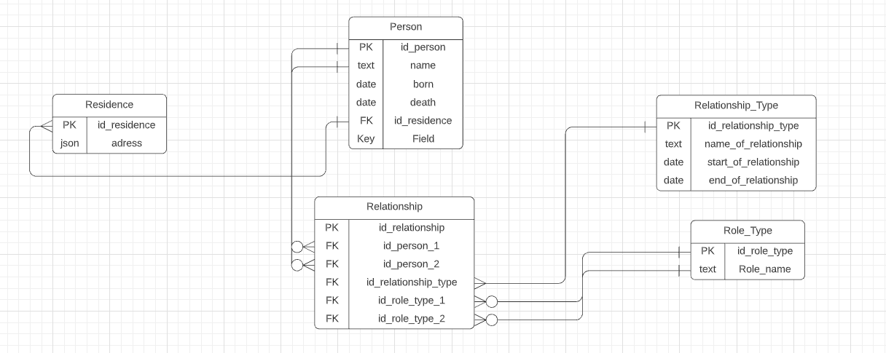

# WebSitePractical
# Структура БД

# Базовый адрес

Пока не известно

# Описание набора страниц
0. **Верхнее меню** (на каждой странице)
    * Кнопка 'Домашняя страница' -> **Домашняя страница**
    * Кнопка 'Поиск по фамилии' -> **Поиск по фамилии**
    * Кнопка 'Добавить родственника' -> **Добавление родственника**
    * Кнопка 'Изменить информацию о родственнике' -> **Изменения информации о родственнике**
1. **Домашняя страница**
    * Описание проекта целиком
    * Описание функционала каждой кнопки + кликабельная ссылка по ней -> **переход по ссылке**

**Рекурсивный SELECT - запрос из таблицы DEPARTMENT**

2. **Поиск по фамилии**
    * **Окно для ввода фамилии**
      * в случае совпадения -> страница со всеми совпадениями
    * 'кнопка отобразить всех' -> отображение все родственные связи
      * 'кнопка фильтры'
        * переключатель для поиска всех родственников
          * ползунок для отображения предков до все поколения
          * ползунок для отображения потомков до все поколения
          * переключатели для отключения отображения тех или иных типов связи
        * переключатель для отображения тех или иных типов связи
      * 'поле для ввода фамилии' 
        * 'кнопка сохранить'
        * в случае совпадения -> страница со всеми совпадениями
      * 'кнопка отобразить'
    * 'кнопка для графического отображения' -> **Графическое отображение**
    
3. **Добавление родственника**
    * Поле для имя 
    * Поле для даты рождения 
    * Поле для даты смерти 
    * Поле для краткой характеристики 
    * Места проживания 'кнопка добавления места проживания' -> **страница добавления места проживания**
    * Таблица всех добавленных связей 1 порядка
    * 'кнопка добавления связи' -> **страница добавления связи**
    * 'кнопка добавить'
      
4. **Изменения информации о родственнике**
    * 'Кнопка для поиска о родственнике среди всех личностей' 
      * Вывод сообщения о нахождении такого родственника
      * Вывод сообщения о ненахождении такого родственника и предложение перейти на страницу добавления родственника * 
    * **Текущие значения в соответствующих полях** 
    * Полное имя 'кнопка для изменения этого поля'
    * Даты рождения 'кнопка для изменения этого поля'
    * Дата смерти 'кнопка для изменения этого поля'
    * Краткая характеристика 'кнопка для изменения этого поля'
   * Таблица всех существующих связей 1 порядка
   * 'кнопка изменения связи' напротив всех связей -> **страница изменения связи**

5. **Добавление места проживания**
   * Поля для ввода адреса, согласно структуре json
   * Поле для ввода даты начала проживания 
   * Поле для ввода даты окончания проживания 
   * 'Кнопка сохранить' -> **возвращения на предыдущую страницу**
   
6. **Добавление связи**
   * Таблица всех существующих связей 1 порядка
   * 'Выпадающей меню для выбора типа связи'
   * Поле для поиска личности
   * Прочие поля для данного типа связи
   * 'Кнопка сохранить' -> **возвращения на предыдущую страницу**

7. **Изменение связи**
   * Таблица всех существующих связей 1 порядка
   * 'Кнопка изменить над каждой личностью'
     * Поле для поиска личности
     * Прочие поля для данного типа связи
   * 'Кнопка удаление связи'
   * 'Кнопка сохранить' -> **возвращение на предыдущую страницу**

8. **Графическое отображение**
   * граф со связями, которые передала предыдущая страница
   * 'Кнопка вернуться назад' -> **возвращение на предыдущую страницу**

9. **страница со всеми совпадениями**
   * таблица со всеми данными о человеке
     * напротив каждой строки 'кнопка выбрать'
   * 'кнопка сохранить' -> **возвращение на предыдущую страницу**
# Сценарии использования

1. Получение списка людей по фамилиям, разнообразным родственным связям с определенным человеком (родители, дети, супруги, братья-сестры, родственники во втором колене, по супругам и пр.).
    * Просмотр информации о том куд двигаться
        * **Домашняя страница**
    * Переход к странице для получения списка людей
        * **Домашняя страница** --'Поиск по фамилии'
    * Ввод фамилии, которая интересует пользователя когда однофамильцев много
        * **Домашняя страница** --'Поиск по фамилии'-> **Поиск по фамилии** -- 'ввод фамилии' -> страница со всеми совпадениями -- выбор нужного -- 'сохранить' -> Поиск по фамилии
    * Ввод фамилии, которая интересует пользователя и настройка типов связи
        * **Домашняя страница** --'Поиск по фамилии'-> **Поиск по фамилии** -- 'ввод фамилии' -- 'включение переключателя для поиска конкретной типа связи которая интересует пользователя' -- 'построить'
2. Получение генеалогического дерева человека — все предки
   * Просмотр информации о том куда двигаться
      * **Домашняя страница**
   * Переход к странице для получения списка людей
      * **Домашняя страница** --'Поиск по фамилии'-> **Поиск по фамилии**
   * Ввод фамилии, которая интересует пользователя когда однофамильцев много
      * **Домашняя страница** --'Поиск по фамилии'-> **Поиск по фамилии** -- 'ввод фамилии' -> страница со всеми совпадениями -- выбор нужного -- 'сохранить' -> Поиск по фамилии
   * Ввод фамилии, которая интересует пользователя и настройка отображения всех предков
      * **Домашняя страница** --'Поиск по фамилии'-> **Поиск по фамилии** -- 'ввод фамилии' -- 'перевод ползунка для поиска предков до значения все' -- 'построить'
   * Построение графа со всеми предками 
      * 'Ввод фамилии, которая интересует пользователя и настройка отображения всех предков' -- 'кнопка для графического отображения' -> **Графическое отображение** -- 'вернуться назад' -> **Поиск по фамилии**
3. Получение дерева потомков человека
   * Просмотр информации о том куда двигаться
      * **Домашняя страница**
   * Переход к странице для получения списка людей
      * **Домашняя страница** --'Поиск по фамилии'-> **Поиск по фамилии**
   * Ввод фамилии, которая интересует пользователя когда однофамильцев много
      * **Домашняя страница** --'Поиск по фамилии'-> **Поиск по фамилии** -- 'ввод фамилии' -> страница со всеми совпадениями -- выбор нужного -- 'сохранить' -> Поиск по фамилии
   * Ввод фамилии, которая интересует пользователя и настройка отображения всех потомков
      * **Домашняя страница** --'Поиск по фамилии'-> **Поиск по фамилии** -- 'ввод фамилии' -- 'перевод ползунка для поиска потомков до значения все' -- 'построить'
   * Построение графа со всеми предками
      * 'Ввод фамилии, которая интересует пользователя и настройка отображения всех предков' -- 'кнопка для графического отображения' -> **Графическое отображение** -- 'вернуться назад' -> **Поиск по фамилии**
4. Получение всех видов родственных связей между двумя людьми (не очень понял о чем идёт речь)
   * Просмотр информации о том куда двигаться
      * **Домашняя страница**
   * Переход к странице для получения списка людей
      * **Домашняя страница** --'Поиск по фамилии'-> **Поиск по фамилии**
   * Ввод фамилии, которая интересует пользователя когда однофамильцев много
      * **Домашняя страница** --'Поиск по фамилии'-> **Поиск по фамилии** -- 'ввод фамилии' -> **страница со всеми совпадениями** -- выбор нужного -- 'сохранить' -> Поиск по фамилии
   * Ввод фамилии, которая интересует пользователя и настройка отображения всех связей с другим человеком
      * **Домашняя страница** --'Поиск по фамилии'-> **Поиск по фамилии** -- 'ввод фамилии' -- 'ввод в поле фамилии второго человека' -- 'построить'
   * Ввод фамилии, которая интересует пользователя и настройка отображения всех связей с другим человеком при совпадении другого человека с кем-то ещё
     * **Домашняя страница** --'Поиск по фамилии'-> **Поиск по фамилии** -- 'ввод фамилии' -- 'ввод в поле фамилии второго человека' -> **страница со всеми совпадениями** -- выбор нужного -- 'сохранить' -> **Поиск по фамилии** -- 'построить'
5. Добавление данных о человеке, их чтение и редактирование
   * Просмотр информации о том куда двигаться
      * **Домашняя страница**
   * Переход к странице для добавления человека
      * **Домашняя страница** --'Добавление родственника'-> **Добавление родственника**
   * Добавление данных человека в штатном режиме
      * **Домашняя страница** --'Добавление родственника'-> **Добавление родственника** -- ввод в поле имени, ввод в поле даты рождения, ввод в поле даты смерти, ввод в поле краткой характеристики -- 'кнопка добавления места проживания' -> **страница добавления места проживания** -- ввод в поля для адреса, даты начала проживания, даты окончания проживания -- 'Кнопка сохранить' -> **возвращения на предыдущую страницу** -- 'кнопка добавления связи' -- заполнение всех полей, добавление нужного количеств родственников -- 'Кнопка сохранить' -> **возвращения на предыдущую страницу** -- 'кнопка добавить'
   * Ошибка при заполнении поля дата рождения|смерти
      * **Домашняя страница** --'Добавление родственника'-> **Добавление родственника** -- ввод в поле ... -- 'кнопка добавить' -- Всплывающая ошибка о неправильной дате рождения|смерти -- выделение полей красным, где была допущена ошибка
   * Ошибка при заполнении полей даты проживания по адресу 
      * **Домашняя страница** --'Добавление родственника'-> **Добавление родственника** -- ввод в поле ... -> **страница добавления места проживания** -- ввод в поля для адреса, даты начала проживания, даты окончания проживания -- 'Кнопка сохранить' -- Всплывающая ошибка о неправильной дате -- выделение полей красным, где была допущена ошибка...